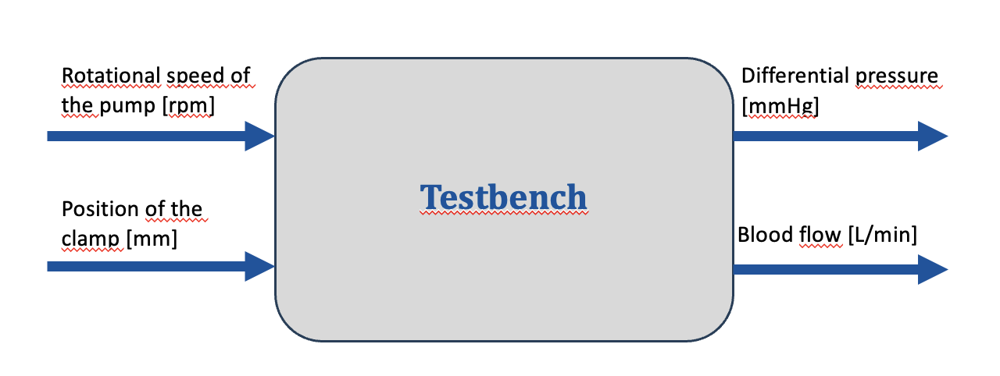
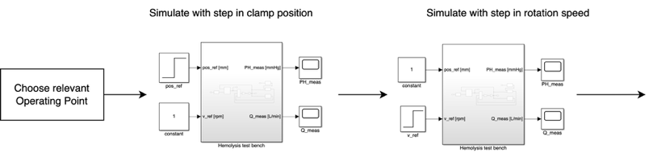
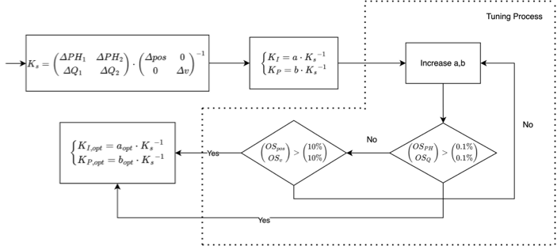
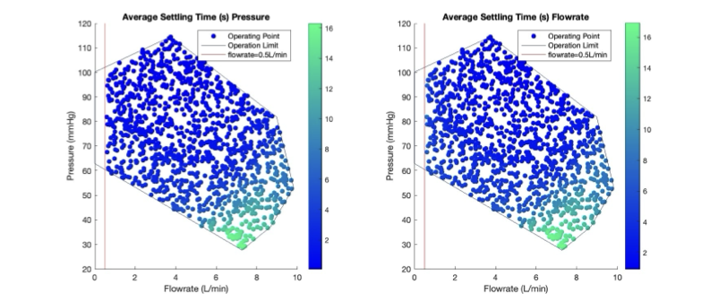
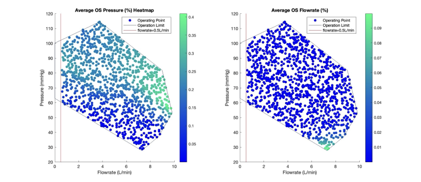

# Hemolysis Test Bench Model

## Overview

This is a matlab project for a seminar that I did during my bachelor study. The task was to design a simple controller for a MIMO hemolysis test bench using MATLAB and Simulink. The PI-controller is an implementation of the algorithm provided in "Regelungstechnik 2" by Lunze, Chapter 5

## System

### Input signals:

 pos_ref [mm]: reference position of the clamp (0 means clamp is completely up); value range: 12mm - 21mm
 v_ref [rpm]: reference speed of the pump; value range: 5000 rpm - 10000 rpm

### Output signals:
 PH_meas [mmHg]: Measured head pressure (outlet - inlet pressure of the pump)
 Q_meas [L/min]: Measured flows

## Algorithm

## Results

## How to run the scripts

 To change the plant model, please change it all in ControlledHemoTestBench.slx, HemoTestBench.slx, TestController.slx and TestController2.slx.

1. Run "InitTestBench.m" before running "HemoTestBench.slx"! "InitTestBench.m" will determine the Lookup-Table for the static pump map, the turbulent tube resistance and the clamp resistance.

2. Run "controller_design.m" to start the program. It will call "simulation.m" to simulate the plant in order to obtain the necessary measurements.

3. You can change the granularity of the simulation by changing the step unit in "simulation.m". The simulation is designed as 2 seperate simulation with step input at one input of the plant, while the other stays constant.

4. After "simulation.m" is done, the program will calculate the static matrix and then start using this and open "ControlledHemoTestBench.slx" to tune the controller for each specified point of interest in the *aps* array.

5. You can add or remove the points of interest by changing the *aps* vector.

6. After tuning process ends, it will save *a*, *b*, *settling time* (starting time when output stays inside 1% band of reference), *OS of the outputs*, and *OS of the inputs* to the plant for each of the points of interest as an instance of the struct Ks. 
7. End result is saved inside opt_controllers.mat

8. "controller_test.m" will simulate the tuned controllers for either step or PT1 reference and plot the step response (of plant's outputs and optionally inputs). Uncomment the relevant part and comment the unrelevant part to do this.

9. "show_result.m" will plot OS and Settling Time colormap for the chosen controller in the relevant operating range.

10. "plot_inv_ks.m" function will plot the entries of inverse of the static matrix Ks to clamp position at each pump speed.

11. "plot_static.m" function will plot the entries of the static matrix to clamp position at each pump speed.

- "TestController2.slx" is a model with step reference input
- "TestController.slx" is a model with PT1 reference input
- "op_bereich_vertices.mat" is a file saving the vertices that make up the operating range

